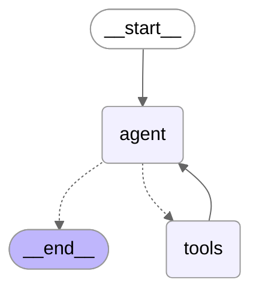

This is me learning about ReAct (Reasoning and Acting) and how to use it in my projects.
I will be using the ReAct framework to build intelligent agents that can reason and act in complex environments.




## Example

Example question and response is shown below. By looking at the debugging output,
I can see the `get_major_scale`, `get_blues_scale`, and `search` tools used.

```text

╭─────────────────────────────────────────── User Question ────────────────────────────────────────────╮
│ Question: What the notes the C major, minor, and blues scales? What can you tell me about cool jazz? │
╰──────────────────────────────────────────────────────────────────────────────────────────────────────╯
╭──────────────────────────────────────────────────────────────────────────────────────── Agent Response ────────────────────────────────────────────────────────────────────────────────────────╮
│ Response: Let me break this down for you, man.                                                                                                                                                 │
│                                                                                                                                                                                                │
│ **C Major Scale:**                                                                                                                                                                             │
│ C - D - E - F - G - A - B                                                                                                                                                                      │
│                                                                                                                                                                                                │
│ **C Blues Scale:**                                                                                                                                                                             │
│ C - D# - F - F# - G - A#                                                                                                                                                                       │
│                                                                                                                                                                                                │
│ **C Minor Scale:**                                                                                                                                                                             │
│ Now, for the C minor scale, that's C - D - Eb - F - G - Ab - Bb. It's got those flatted thirds, sixths, and sevenths that give it that darker, more emotional quality.                         │
│                                                                                                                                                                                                │
│ **About Cool Jazz:**                                                                                                                                                                           │
│                                                                                                                                                                                                │
│ Cool jazz... well, that's something I know intimately. We developed it as a reaction to bebop in the late '40s and early '50s. While bebop was all fire and intensity, cool jazz brought a     │
│ more relaxed, restrained approach.                                                                                                                                                             │
│                                                                                                                                                                                                │
│ The key characteristics:                                                                                                                                                                       │
│ - **Softer, more restrained sound** - not as aggressive as bebop                                                                                                                               │
│ - **More formal arrangements** with classical music influences                                                                                                                                 │
│ - **Moderate tempos** - we slowed things down, gave space to breathe                                                                                                                           │
│ - **Lighter tone and softer attack** on the instruments                                                                                                                                        │
│ - **More reflective attitude** - it was about subtlety and nuance                                                                                                                              │
│                                                                                                                                                                                                │
│ My 1957 album *Birth of the Cool* really defined this movement. We used unusual instrumentation - French horns, tuba, alongside the standard jazz instruments. Working with arranger Gil       │
│ Evans, we created this different palette of sounds.                                                                                                                                            │
│                                                                                                                                                                                                │
│ Cool jazz opened doors to modal jazz and influenced bossa nova later on. It was about playing what you don't play as much as what you do play - the space between the notes, dig?              │
╰────────────────────────────────────────────────────────────────────────────────────────────────────────────────────────────────────────────────────────────────────────────────────────────────╯
```
